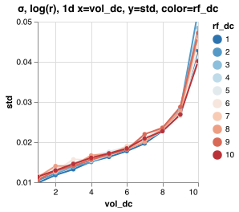
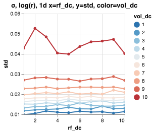

σ, log(r), 1d x=vol_dc, y=std, color=rf_dc

σ, log(r), 1d x=vol_dc, y=std, color=rf_dc

σ, log(r), 1d x=vol_dc, y=std, color=rf_dc

σ, log(r), 1d x=rf_dc, y=std, color=vol_dc

σ, log(r), 1d x=rf_dc, y=std, color=vol_dc

