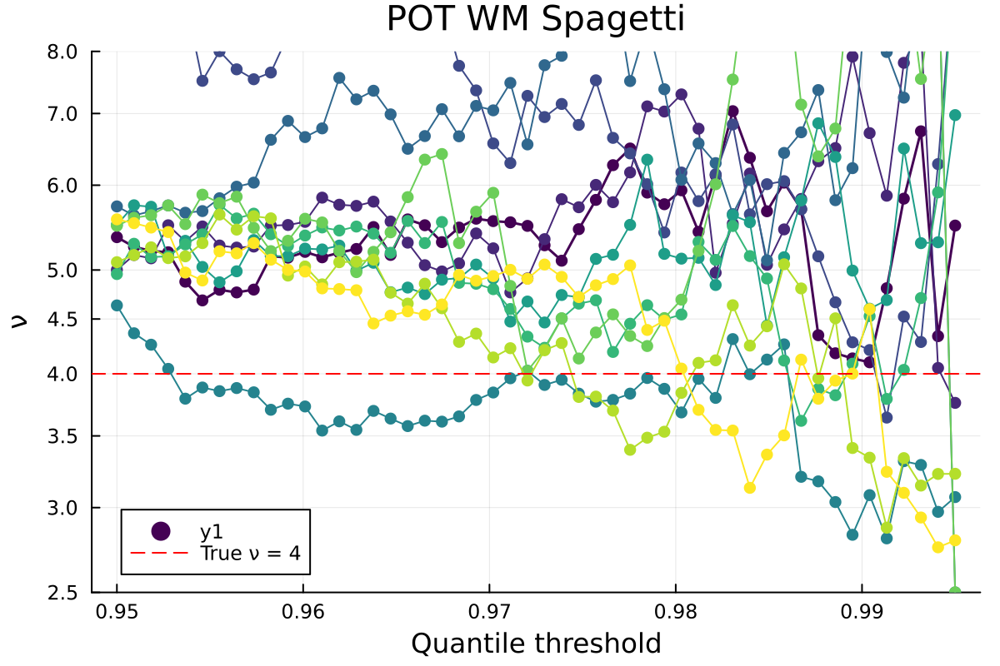
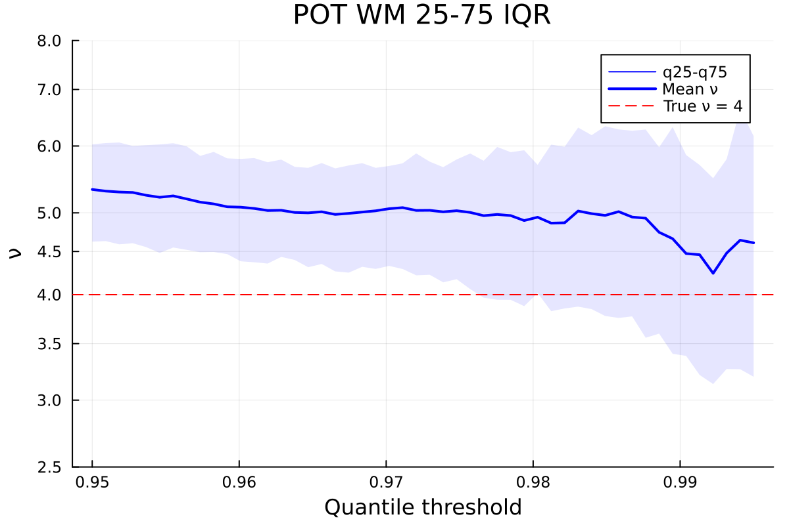
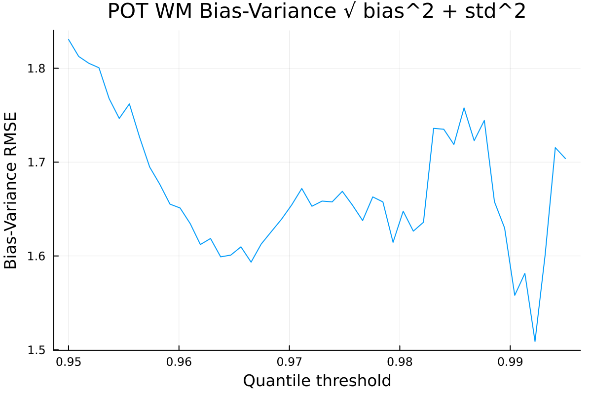

Measuring the precision of EVT Peak Over Threshold (POT) method.

**Result**: out of the box it's no good at all, both bias and variance are high. It systematically underestimates the tail power ν, and very fragile slightest change in the treshold or sample produces wildly different results.

### Experiment

Use 100 trials of `StudentT(ν=4)` samples 20k size to estimate the tail power ν using the Peak Over Threshold (POT) method.

Each sample estimated for various treshold quantile `q ∈ [0.95, 0.995]`.

Only plots for MLE and Weighted Moments estimators shown, I also tested Bayesian it's no better.

Run `julia evt/evt.jl`.

### Spagetti Plot

Each line is separate trial.

### Bias-Variance

