Correcting bias in EVT Peak Over Threshold (POT)

**Problem**: POT is biased, it fails to estimate `StudenT(ν=4)` even on large 50k samples. Systematically
underestimating the tail power ν.

**Solution**: Use use weighted MLE estimator with higher weights on underestimated points to correct the bias.

### Experiment

Data: 100 trials of `StudentT(ν=4)`, each 20k sample.

Various treshold quantiles `q ∈ [0.95, 0.995]` used to estimate the tail exponent, and for each quantile bias and
variance calculated across 100 trials. The quantile used instead of explicit treshold to make estimation
independent of the sample size.

Then same repeated for "Weighted MLE" estimator, which boosts the weights of underestimated points.

Only results for POT MLE estimator shown, there are also Weighted Moments and Bayesian estimators, I tested it, they
are no better than MLE, same results.

Run `julia evt/evt.jl`.

### Spagetti Plot

Visual assessment of 10 trials with various quantile tresholds, each trial is a separate line.

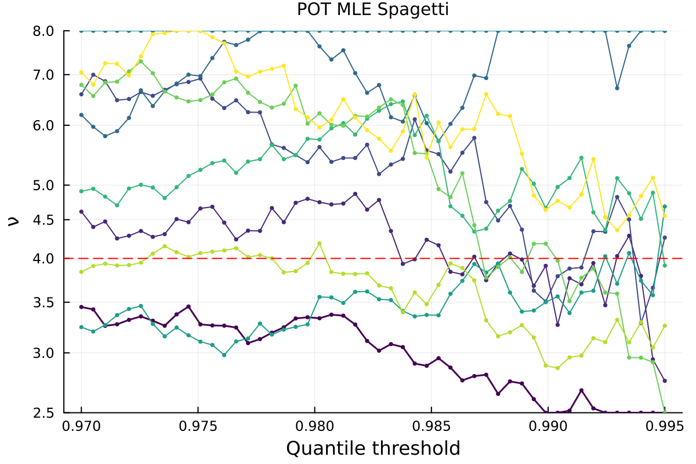

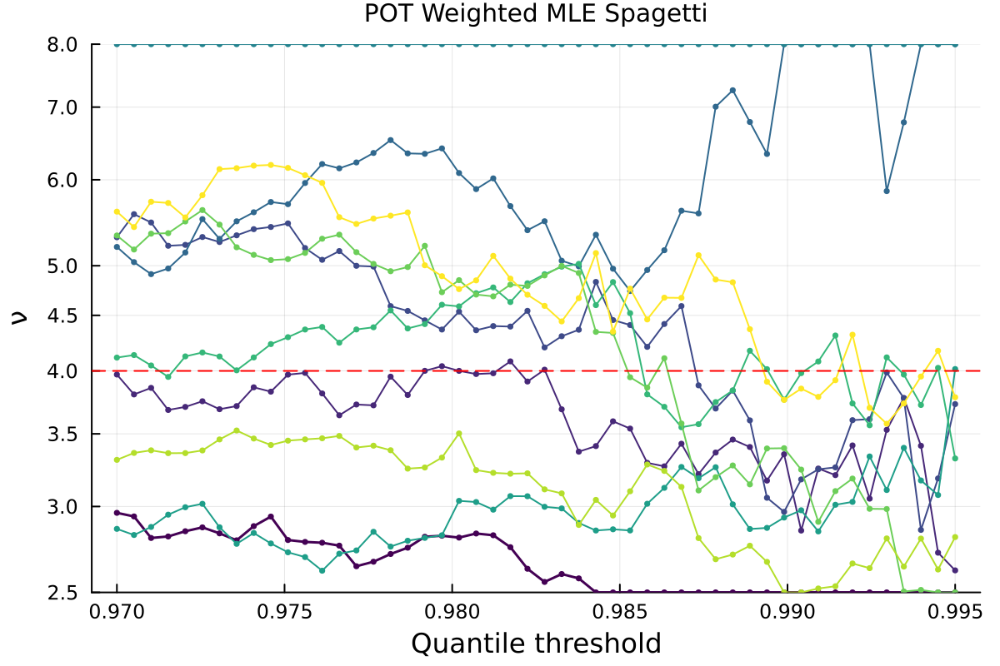

### Bias-Variance

Inter quartile range (IQR) of the tail exponent ν across 100 trials for various quantile tresholds.

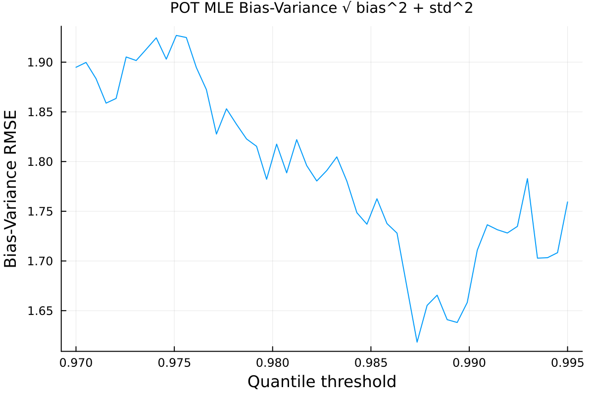

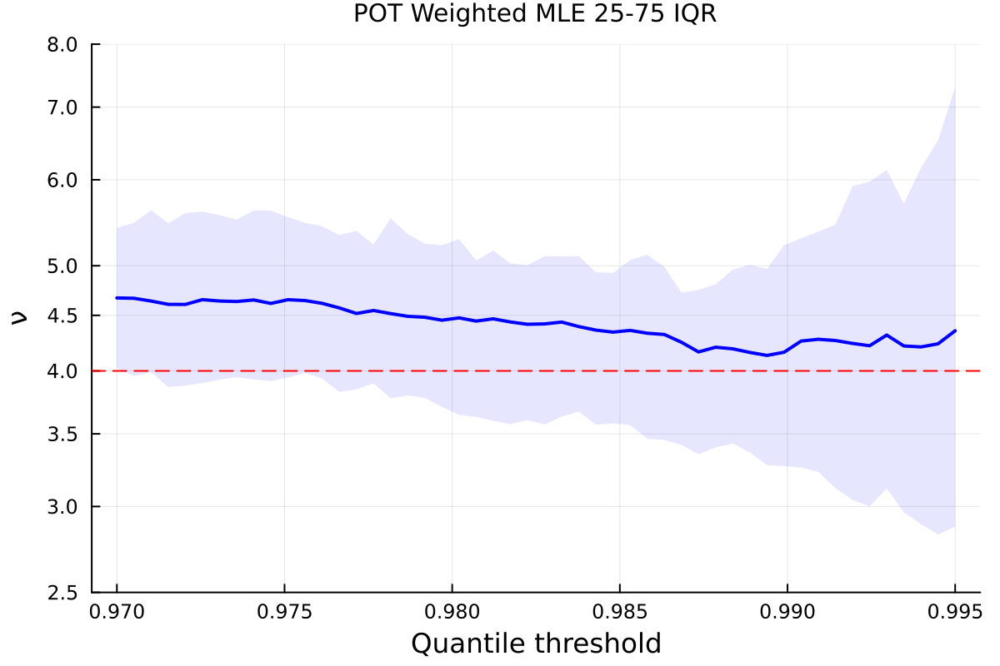

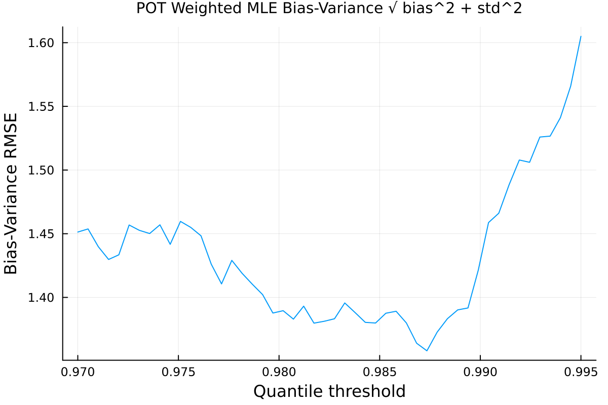

### Log Log Plots

Visual assessment of 9 trials with optimal quantile = 0.9850.

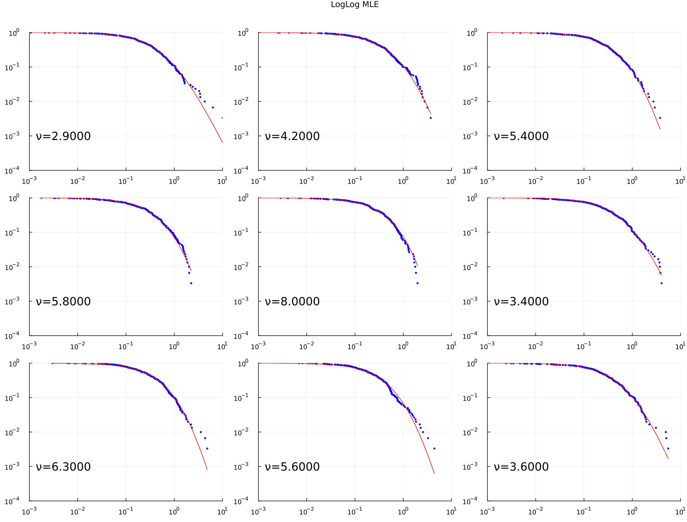

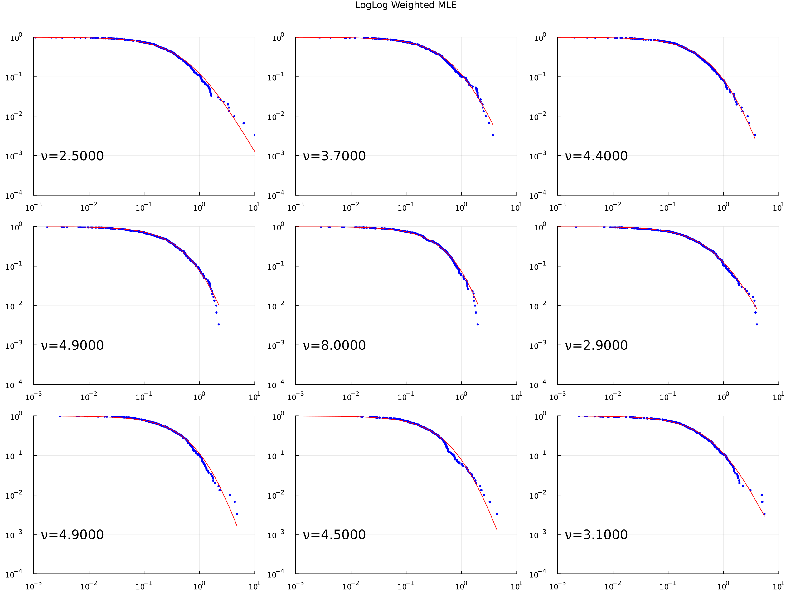

### Checking if Weighted MLE also works for other ν = 3, 6

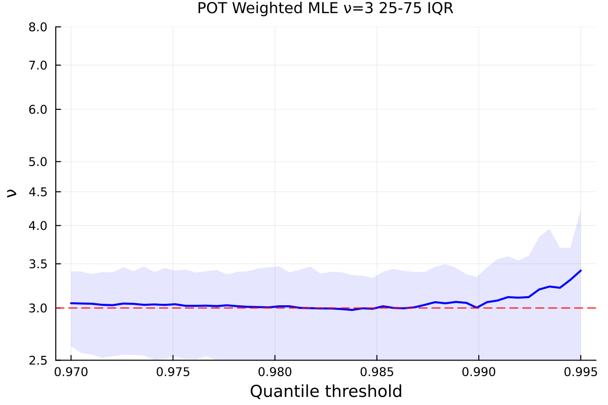

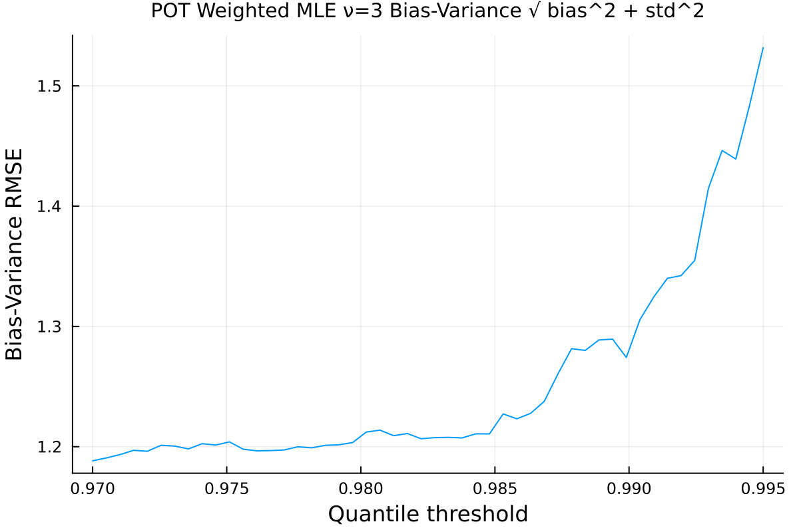

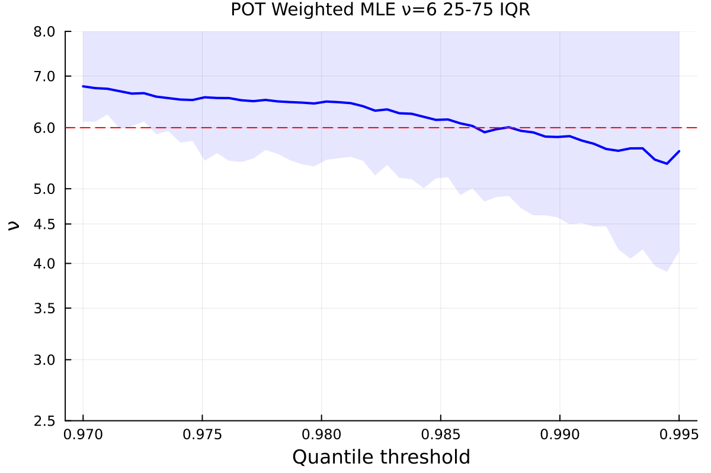

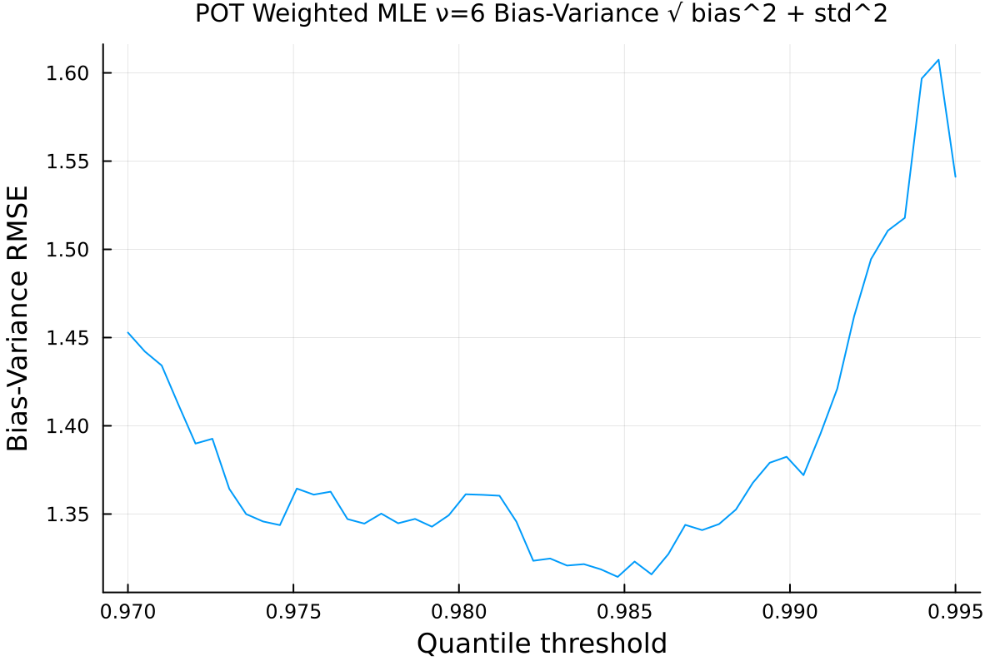

