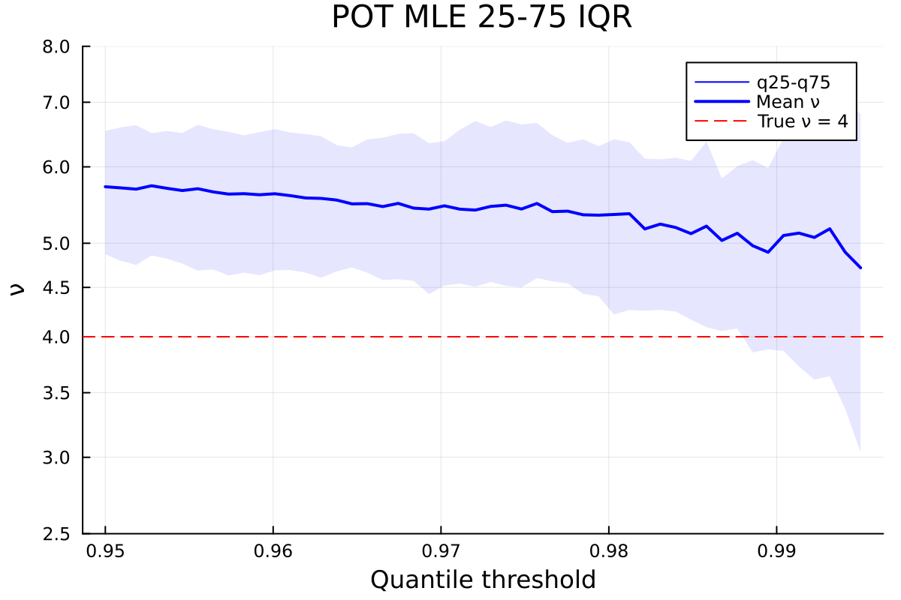

Profit hunting experiments and explorations.

- For **individual** risking their **own money**, not funds or institutions.
- Financial risk and uncertainty.
- Portfolio protection with put options.
- Bounded-loss option strategies.
- Financial statement analysis (Greenblatt).

[Stock Expected Return E[R]](mean)

![Mean E[R] (x=lr_rf, y=adjusted, c=volg, dashed=original, by period)](mean/readme/mean-e-r-x-lr-rf-y-adjusted-c-volg-dashed-original-by-period.png)

[Stock Option Normalisation](option_norm)

![Norm Premium P/E[R]/Scale[log R], Norm Strike P(R < K | vol)](option_norm/readme/norm-premium-p-e-r-scale-log-r-norm-strike-p-r-k-vol.png)

[Extreme Value Theory, Heavy Tails](evt)

### TODO

- option_norm: rescale mmean plot as `(365/period)E[R]`.
- maybe add HoloViz https://panel.holoviz.org/reference/index.html (integrates with vscode and live update), streamlit, Pluto.jl