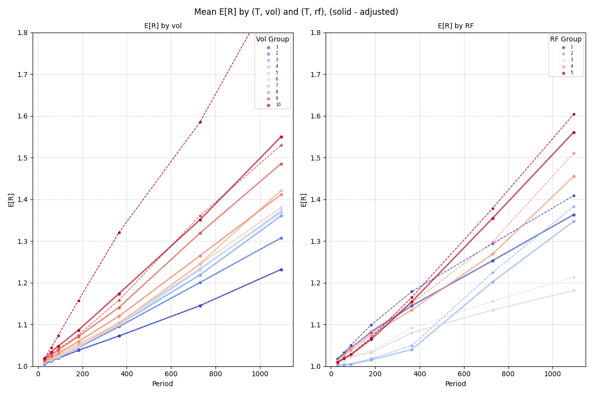

- Financial risk and uncertainty.
- Portfolio protection with put options.
- Bounded-loss option strategies.
- Financial statement analysis (Greenblatt).

[Stock Expected Return E[R]](mean)

[Stock Option Normalisation](option_norm)

[Tails of Stock Returns](tail)

[High precision estimator for Tail Exponent, Extreme Value Theory](tail-estimator)

### TODO

- update pycall -> pythoncall
- Baker’s generalised asymmetric-t (GAT)
- AST — Asymmetric Student-t (Zhu & Galbraith, 2010).
- Finance: which stock option gives the highest return, under time-varying return profiles.
- left vs right tails exponent
- option_norm: rescale mmean plot as `(365/period)E[R]`.
- maybe add HoloViz https://panel.holoviz.org/reference/index.html (integrates with vscode and live update), streamlit, Pluto.jl

### Notes

- Julia-Python interop PythonCall.jl and juliacall