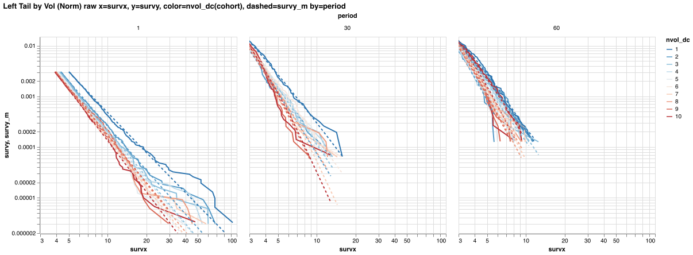
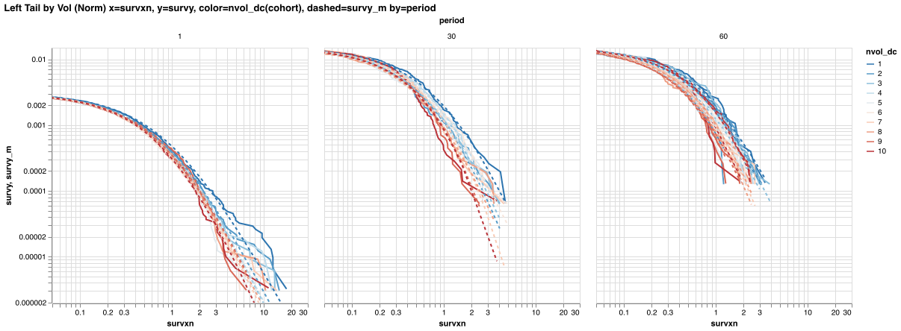
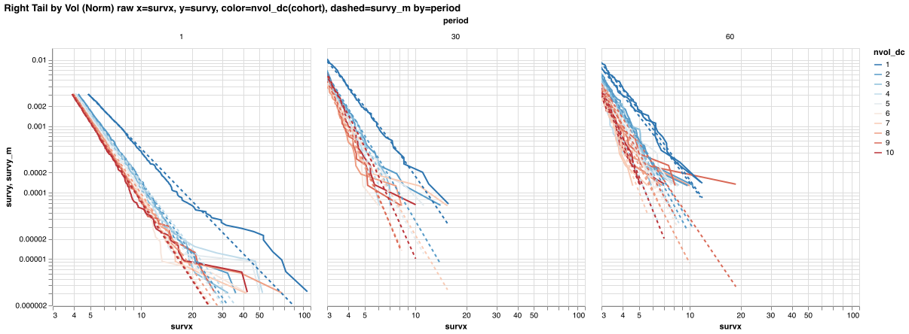
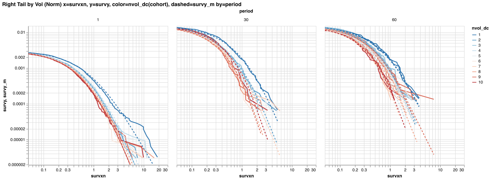
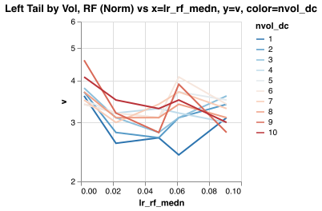
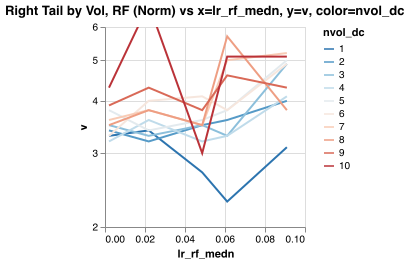

Estimating tail exponent of stock log returns

Run `julia tail/tail.jl`.

### Goal

Estimate left and right tails for stock log returns for different periods 1d, 30d, 365d periods
and volatility levels, from historical data.

Normal US NYSE+NASDAQ stock only, no penny stock like AMEX or OTC.

### Results


Data has 3.4m days. Reliable estimation require 10k sample size or <340d periods, rough
estimation 5k or <680d. And if grouped by 10 volatility levels <34d and for 5 vol levels <68d.

**1d: ν_l=2.7, ν_r=2.9**, normalised returns. It depends how returns
normalised, varying 2.7-3.2.

For larger periods: **30d: ν_l=3.5, ν_r=3.7**. Note 30d has x30 less data than 1d returns,
still it should be enough to estimate the tail. Periods >=60d less realiable, they have much
less data, and maybe the data bias more prominent.

Mathematically the exponent should be resistant to aggregation `Pr(X>x|for large x) ~ Cx^-ν`, but
it may not be true for a) if x sampled from differrent distributions and b) pre asymptotic
c) bounded x.

In my opinion larger periods follow `ν = a + b log T`, solving it for 1d and 30d:

```
ν_l(t) = 2.7 + 0.2352log(t)
ν_r(t) = 2.9 + 0.2352log(t)
```

Data has both omission (bankrupts) and comission biases - so tails may be a bit wrong.

### Methodology

- Historical log returns `log r_t2 = log S_t/S_t2` for `t in [1d, 30d, ..., 1095d]`.
- Volatility `nvol_t = 0.8 current_vol_t + 0.2 historical_vol`, where current over recent period
  `EMA[MAD[log r]]*sqrt(pi/2)` and historical `MAD[log r]*sqrt(pi/2)` over long period.
- Normalise log returns as `log r_t2 / nvol_t`, each return individually.
- Decluster per stock, allow no more than 1 tail event within window = 30d for 1d returns and
  larger windows for longer periods.
- Allow clusters across stocks - when many stock drop on same day.
- EVT POT GPD approach with [DEDH-HILL](/tail-estimator) estimator.

### Other studies

Results depend on return normalisation, so may be different.

**Study1**: [Tail Index Estimation: QuantileDriven Threshold Selection](https://www.bankofcanada.ca/wp-content/uploads/2019/08/swp2019-28.pdf)
, one of authors is Laurens de Haan, pioneer of EVT and inventor of one of the best estimators
"DEDH", so I guess numbers they got analysing CRSP stock returns are worth to consider.

Results from KS estimator: left tail 3.4, right tail 2.97 from [Table 7](docs/study1-table7.jpg).
Estimator has bias 3/2.85 from [Table 1](docs/study1-table1.jpg). Correcting results left tail
3.4 * 3/2.85 = 3.58, right tail 2.97 * 3/2.85 = 3.13.

**Study2**: various mentions by N. Taleb that tails ~3.

### Data

Daily prices of 250 stocks all starting with 1972, [details](/hist_data)`.

1d and 30d returns calculated with moving window(size=30, step-30).

For larger periods >=60d, cacluation a bit more complex, using cohorts, you can ignore details
and just consider it as multiple version of same returns, you will see it as multiple lines
on plots with periods >=60d. It's used to get more information from the data and avoid
overlapping bias, correlation, returns calculated as moving window(start=cohort, size=period,
step=period), each cohort shifts initial position by +30.

### Questions

I used unusual estimator [Tail Estimator](/tail-estimator) that in my opinion is much better and
apply normalisation by volatility and choose tail threshold differently.

My data is biased, no bankrupts, if you have access to full market unbiased data,
**let me know** please, I would be interested to analyse it.

If you find errors or know a better way, let me know please.

### TODO

- In order to avoid submission bias - estimate tail for each stock individually and analyse it.
- Calculate credible intervals.

### Tails of normalised log returns

1d tails on chart start with lower probability because 1d has more data and higher treshold
quantile.

Left Tail (Norm) x=survxn, y=survy(cohort), dashed=survy_m by=period


Left Tail (Norm) by periods

```
3×3 DataFrame
 Row │ period  ν        ν_model
     │ Int64   Float64  Float64
─────┼──────────────────────────
   1 │      1      2.7      2.7
   2 │     30      3.5      3.5
   3 │     60      4.1      3.7
```

Right Tail (Norm) x=survxn, y=survy(cohort), dashed=survy_m by=period


Right Tail (Norm) by periods

```
3×3 DataFrame
 Row │ period  ν        ν_model
     │ Int64   Float64  Float64
─────┼──────────────────────────
   1 │      1      2.9      2.9
   2 │     30      3.7      3.7
   3 │     60      3.9      3.9
```

### Tails by Vol

Left Tail by Vol (Norm) raw x=survx, y=survy, color=nvol_dc(cohort), dashed=survy_m by=period



Left Tail by Vol (Norm) x=survxn, y=survy, color=nvol_dc(cohort), dashed=survy_m by=period



Left Tail by Vol (Norm) table

```
3×2 DataFrame
 Row │ period  ν
     │ Int64   Float64
─────┼─────────────────
   1 │      1      3.1
   2 │     30      4.1
   3 │     60      5.5
```

```
40×5 DataFrame
 Row │ period  cohort  nvol_dc  tail_k  ν
     │ Int64   Int64   Int64?   Int64   Float64
─────┼──────────────────────────────────────────
   1 │      1       0        1     938      2.6
   2 │      1       0        2     992      2.8
   3 │      1       0        3     993      3.0
   4 │      1       0        4     991      3.0
   5 │      1       0        5     985      3.4
   6 │      1       0        6     995      3.4
   7 │      1       0        7     992      3.2
   8 │      1       0        8     994      3.1
   9 │      1       0        9     982      3.1
  10 │      1       0       10     909      3.4
  11 │     30       0        1     231      3.5
  12 │     30       0        2     235      4.2
  13 │     30       0        3     235      3.8
  14 │     30       0        4     234      4.1
  15 │     30       0        5     237      3.8
  16 │     30       0        6     235      3.5
  17 │     30       0        7     236      6.8
  18 │     30       0        8     236      4.0
  19 │     30       0        9     234      6.9
  20 │     30       0       10     213      6.9
  21 │     60       0        1     113      3.2
  22 │     60       0        2     119      7.0
  23 │     60       0        3     119      3.5
  24 │     60       0        4     118      3.7
  25 │     60       0        5     118      6.8
  26 │     60       0        6     117      6.6
  27 │     60       0        7     115      6.9
  28 │     60       0        8     117      5.5
  29 │     60       0        9     116      7.1
  30 │     60       0       10     112      6.8
  31 │     60       1        1     115      5.3
  32 │     60       1        2     118      3.7
  33 │     60       1        3     118      4.5
  34 │     60       1        4     118      4.3
  35 │     60       1        5     117      6.7
  36 │     60       1        6     115      4.8
  37 │     60       1        7     119      6.2
  38 │     60       1        8     117      5.1
  39 │     60       1        9     117      5.6
  40 │     60       1       10     110      5.6
```

Right Tail by Vol (Norm) raw x=survx, y=survy, color=nvol_dc(cohort), dashed=survy_m by=period



Right Tail by Vol (Norm) x=survxn, y=survy, color=nvol_dc(cohort), dashed=survy_m by=period



Right Tail by Vol (Norm) table

```
3×2 DataFrame
 Row │ period  ν
     │ Int64   Float64
─────┼─────────────────
   1 │      1      3.7
   2 │     30      6.0
   3 │     60      5.2
```

```
40×5 DataFrame
 Row │ period  cohort  nvol_dc  tail_k  ν
     │ Int64   Int64   Int64?   Int64   Float64
─────┼──────────────────────────────────────────
   1 │      1       0        1     941      2.6
   2 │      1       0        2     991      3.7
   3 │      1       0        3     987      3.7
   4 │      1       0        4     986      3.3
   5 │      1       0        5     990      3.7
   6 │      1       0        6     988      3.9
   7 │      1       0        7     993      4.0
   8 │      1       0        8     985      3.7
   9 │      1       0        9     971      4.0
  10 │      1       0       10     957      3.9
  11 │     30       0        1     222      4.2
  12 │     30       0        2     233      4.5
  13 │     30       0        3     236      5.6
  14 │     30       0        4     236      7.1
  15 │     30       0        5     234      4.5
  16 │     30       0        6     237      7.4
  17 │     30       0        7     237      4.3
  18 │     30       0        8     237      6.5
  19 │     30       0        9     233      7.5
  20 │     30       0       10     228      7.1
  21 │     60       0        1     108      4.0
  22 │     60       0        2     117      4.1
  23 │     60       0        3     118      6.1
  24 │     60       0        4     116      7.5
  25 │     60       0        5     116      5.1
  26 │     60       0        6     118      5.1
  27 │     60       0        7     117      7.9
  28 │     60       0        8     118      4.8
  29 │     60       0        9     112      3.7
  30 │     60       0       10     111      7.2
  31 │     60       1        1     104      3.5
  32 │     60       1        2     118      5.4
  33 │     60       1        3     117      6.9
  34 │     60       1        4     116      4.3
  35 │     60       1        5     115      4.4
  36 │     60       1        6     114      5.2
  37 │     60       1        7     118      7.8
  38 │     60       1        8     117      7.2
  39 │     60       1        9     117      4.6
  40 │     60       1       10     114      7.8
```

### Tails by RSI

Left Tail by RSI (Norm) raw x=survx, y=survy, color=rsi_dc(cohort), dashed=survy_m by=period


Left Tail by RSI (Norm) x=survxn, y=survy, color=rsi_dc(cohort), dashed=survy_m by=period


Left Tail by RSI (Norm) table

```
3×2 DataFrame
 Row │ period  ν
     │ Int64   Float64
─────┼─────────────────
   1 │      1      3.0
   2 │     30      3.9
   3 │     60      4.2
```

```
40×5 DataFrame
 Row │ period  cohort  rsi_dc  tail_k  ν
     │ Int64   Int64   Int64?  Int64   Float64
─────┼─────────────────────────────────────────
   1 │      1       0       1     946      3.1
   2 │      1       0       2     995      2.9
   3 │      1       0       3     996      3.2
   4 │      1       0       4     996      3.3
   5 │      1       0       5     995      3.1
   6 │      1       0       6     996      3.0
   7 │      1       0       7     992      2.9
   8 │      1       0       8     998      3.0
   9 │      1       0       9     997      3.3
  10 │      1       0      10     992      2.6
  11 │     30       0       1     232      4.5
  12 │     30       0       2     234      4.5
  13 │     30       0       3     237      4.6
  14 │     30       0       4     234      3.2
  15 │     30       0       5     237      3.7
  16 │     30       0       6     236      3.9
  17 │     30       0       7     236      2.9
  18 │     30       0       8     235      2.8
  19 │     30       0       9     237      4.3
  20 │     30       0      10     233      3.9
  21 │     60       0       1     112      5.6
  22 │     60       0       2     119      6.9
  23 │     60       0       3     120      6.7
  24 │     60       0       4     119      6.6
  25 │     60       0       5     120      4.9
  26 │     60       0       6     118      6.6
  27 │     60       0       7     116      3.3
  28 │     60       0       8     117      3.9
  29 │     60       0       9     116      3.2
  30 │     60       0      10     113      6.5
  31 │     60       1       1     115      6.6
  32 │     60       1       2     116      3.5
  33 │     60       1       3     115      3.9
  34 │     60       1       4     117      6.4
  35 │     60       1       5     117      4.0
  36 │     60       1       6     118      3.5
  37 │     60       1       7     119      3.2
  38 │     60       1       8     118      3.4
  39 │     60       1       9     121      4.4
  40 │     60       1      10     120      3.5
```

Right Tail by RSI (Norm) raw x=survx, y=survy, color=rsi_dc(cohort), dashed=survy_m by=period


Right Tail by RSI (Norm) x=survxn, y=survy, color=rsi_dc(cohort), dashed=survy_m by=period


Right Tail by RSI (Norm) table

```
3×2 DataFrame
 Row │ period  ν
     │ Int64   Float64
─────┼─────────────────
   1 │      1      3.4
   2 │     30      4.1
   3 │     60      4.0
```

```
40×5 DataFrame
 Row │ period  cohort  rsi_dc  tail_k  ν
     │ Int64   Int64   Int64?  Int64   Float64
─────┼─────────────────────────────────────────
   1 │      1       0       1     989      2.9
   2 │      1       0       2     997      3.6
   3 │      1       0       3     993      3.0
   4 │      1       0       4     990      3.8
   5 │      1       0       5    1000      3.7
   6 │      1       0       6     996      3.5
   7 │      1       0       7     992      3.2
   8 │      1       0       8     991      3.4
   9 │      1       0       9     985      3.4
  10 │      1       0      10     905      3.1
  11 │     30       0       1     234      3.8
  12 │     30       0       2     236      4.1
  13 │     30       0       3     237      3.4
  14 │     30       0       4     237      4.9
  15 │     30       0       5     235      4.3
  16 │     30       0       6     236      3.6
  17 │     30       0       7     235      3.8
  18 │     30       0       8     233      4.0
  19 │     30       0       9     233      4.2
  20 │     30       0      10     229      4.2
  21 │     60       0       1     117      3.5
  22 │     60       0       2     120      3.2
  23 │     60       0       3     119      3.5
  24 │     60       0       4     117      7.8
  25 │     60       0       5     119      4.1
  26 │     60       0       6     116      3.8
  27 │     60       0       7     117      7.4
  28 │     60       0       8     117      3.2
  29 │     60       0       9     115      5.7
  30 │     60       0      10     107      4.7
  31 │     60       1       1     117      3.6
  32 │     60       1       2     116      3.9
  33 │     60       1       3     115      3.5
  34 │     60       1       4     117      4.3
  35 │     60       1       5     117      7.5
  36 │     60       1       6     117      4.1
  37 │     60       1       7     119      3.3
  38 │     60       1       8     118      4.8
  39 │     60       1       9     120      4.8
  40 │     60       1      10     116      3.9
```

### Estimating tail by volatility and risk free rate

Left Tail by Vol, RF (Norm) νs x=lr_rf_medn, y=ν, color=nvol_dc



Right Tail by Vol, RF (Norm) νs x=lr_rf_medn, y=ν, color=nvol_dc



### Tails for all periods.

Left Tail all Periods (Norm) x=survxn, y=survy(cohort), dashed=survy_m by=period


Left Tail all Periods (Norm) by periods

```
8×3 DataFrame
 Row │ period  ν        ν_model
     │ Int64   Float64  Float64
─────┼──────────────────────────
   1 │      1      2.7      2.7
   2 │     30      3.5      3.5
   3 │     60      4.1      3.7
   4 │     91      6.4      3.8
   5 │    182      6.8      3.9
   6 │    365      6.8      4.1
   7 │    730      6.3      4.3
   8 │   1095      5.4      4.3
```

Right Tail all Periods (Norm) x=survxn, y=survy(cohort), dashed=survy_m by=period


Right Tail all Periods (Norm) by periods

```
8×3 DataFrame
 Row │ period  ν        ν_model
     │ Int64   Float64  Float64
─────┼──────────────────────────
   1 │      1      2.9      2.9
   2 │     30      3.7      3.7
   3 │     60      3.9      3.9
   4 │     91      3.8      4.0
   5 │    182      4.4      4.1
   6 │    365      5.1      4.3
   7 │    730      6.8      4.5
   8 │   1095      7.2      4.5
```

Tails by periods x=period, y=ν, color=type, dashed=ν_model


