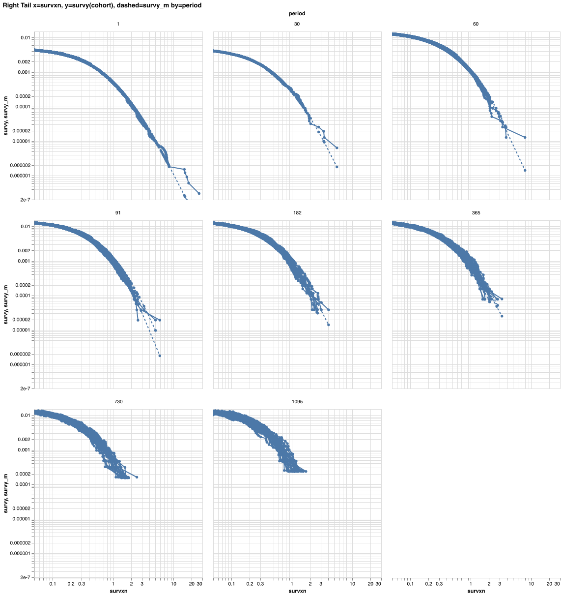
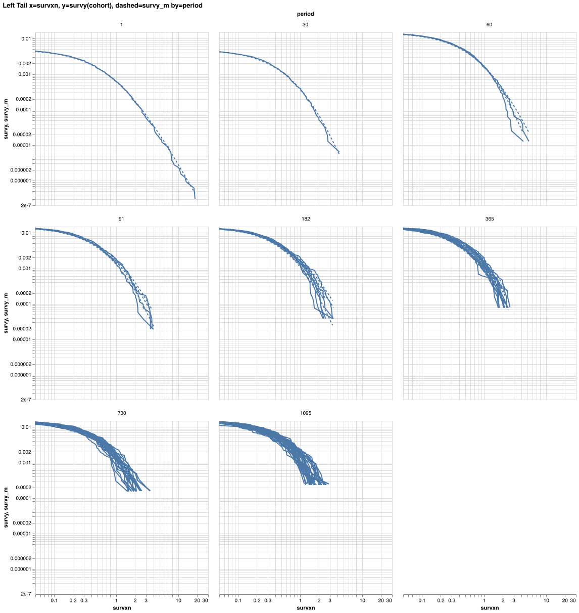
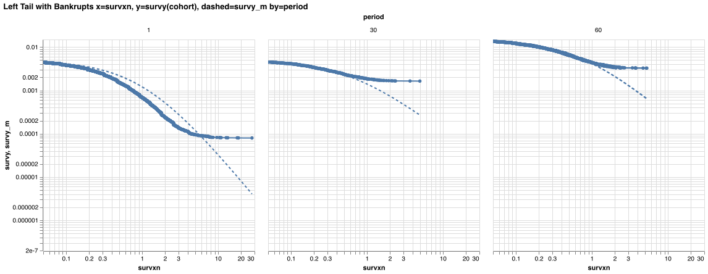
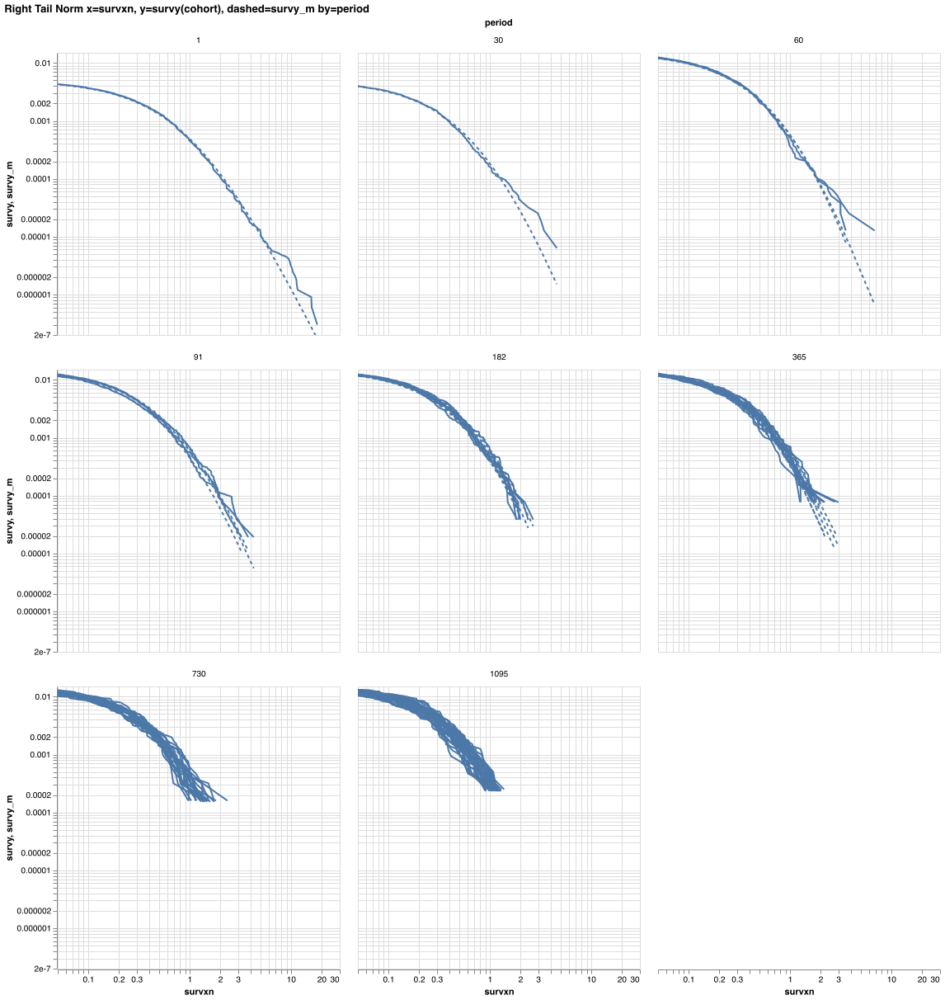
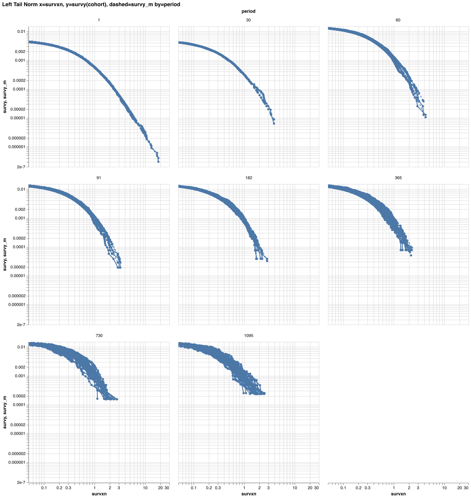
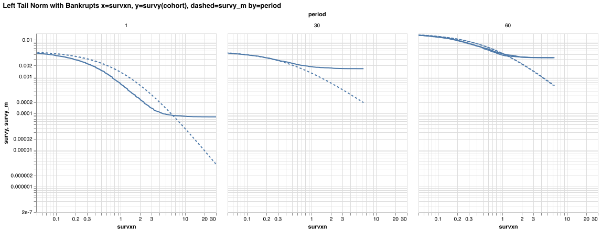
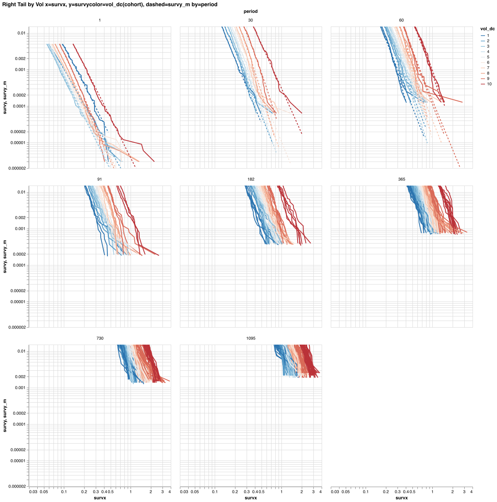
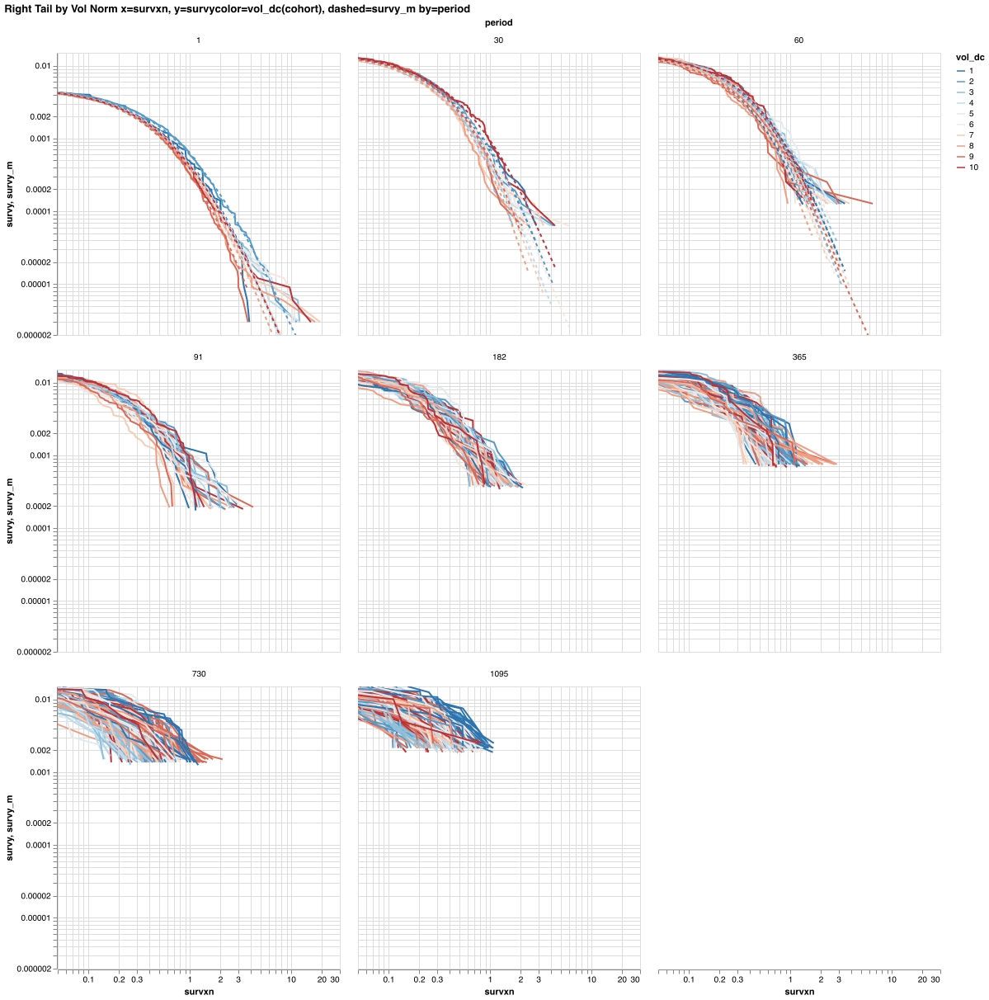
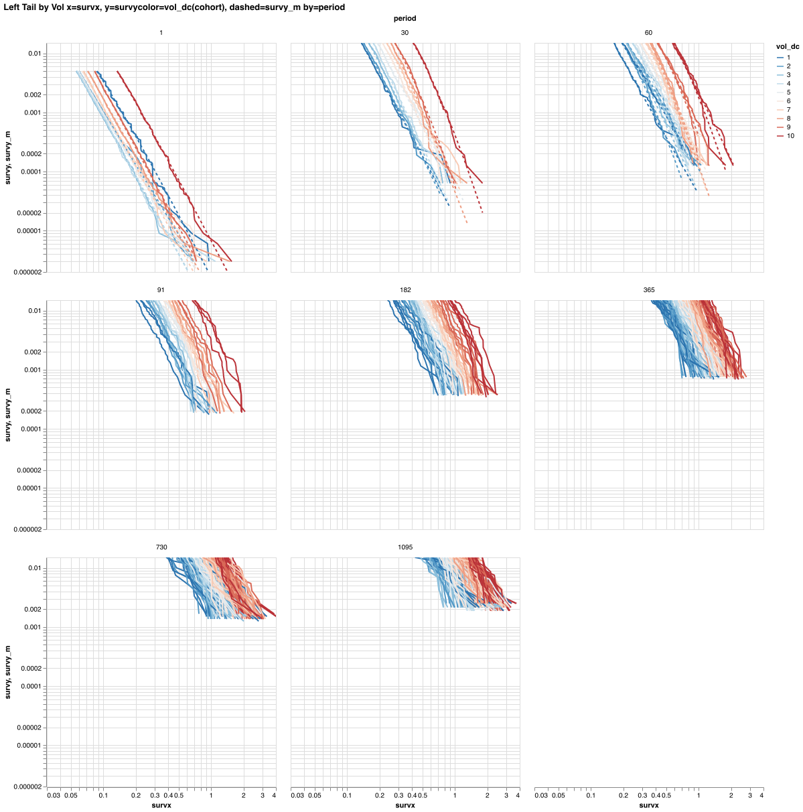
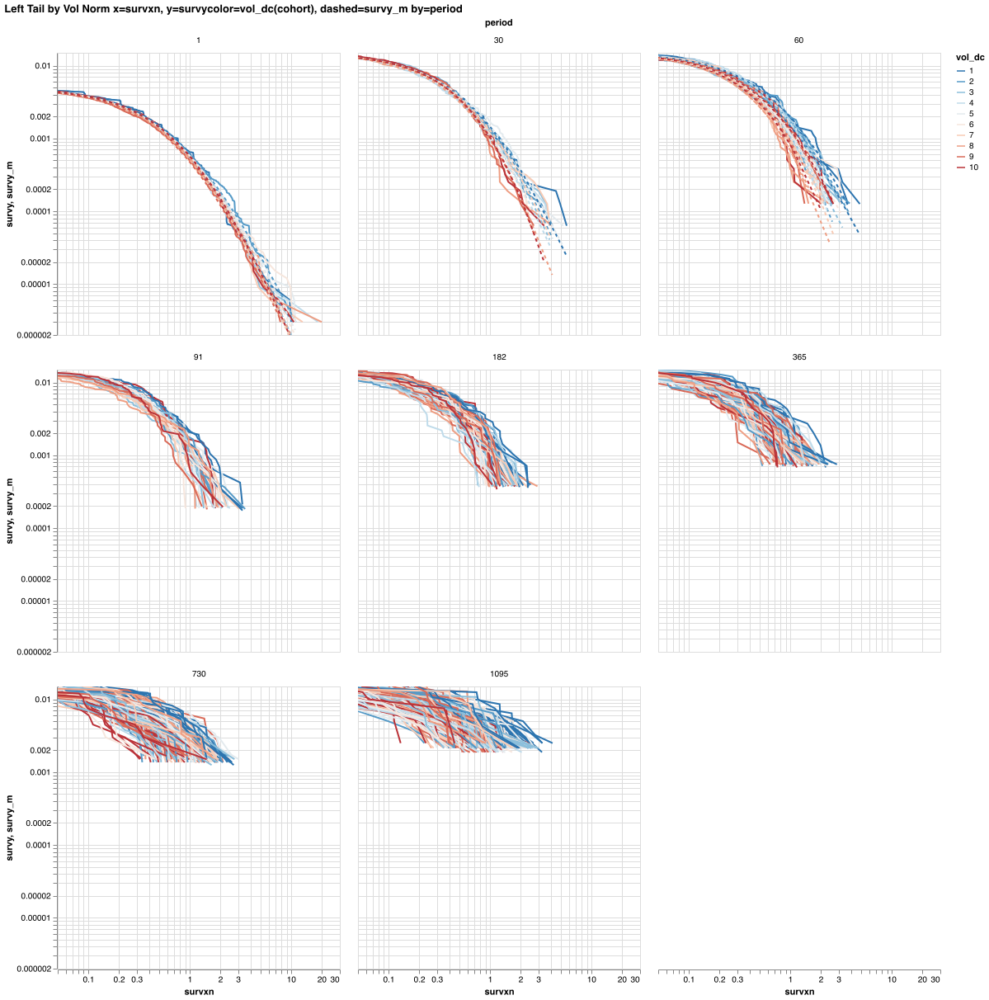

Estimating tail exponent of stock log returns

**Goal**: Estimate left and right tails on 1d, 30d, 365d log returns, using Extreme Value Theory,
[POT GPT DEDH-HILL method](/tail-estimator).

Most interesting periods are 1d and 30d. Larger periods >=60d have much less data and shown for
comparison only.

**Results**: in my opinion **right tail ν=3.6, left tail ν=2.2-2.7**, for all 1d-1095d periods.

I think normalised returns give the most reliable estimation. Estimates for raw
return and returns grouped by volatility deciles are for comparison mostly.

1d: right tail ν=3.6, left tail with synthetic bankrupts ν=2.2, left tail without
bankrupts (the data is biased, no bankrupt distress delisting) ν=3.2. Maybe for the left
tail something in between should be choosen, like ν=2.5, as we can't say for sure if
synthetic bankrupts are correct approximation of real bankrupts.

30d: right tail ν=4.6, left tail with synthetic bankrupts ν=1.2, left tail without
bankrupts ν=4.0. I think it has same tails as 1d, because tail exponent resistant to
aggregation, we observe less heavy tails for 30d because there's x30 less data. The left tail
with synthetic bankrupts is unusually small, I guess because it's only approximation of real
bankrupts, and it distort the estimator and should be ignored.

Larger periods >=60d: I think estimates for larger periods are wrong, because they have much
less data, and present for comparison only. I think they have same tail exponents
as 1d, because tail exponent is resistant to aggregation.

**Data**: Daily prices of 250 stocks all starting with 1972, [details](/hist_data)`.

1d and 30d returns calculated with moving window(size=30, step-30).

For larger periods >=60d, cacluation a bit more complex, using cohorts, you can ignore details
and just consider it as multiple version of same returns, you will see it as multiple lines
on plots with periods >=60d. It's used to get more information from the data and avoid
overlapping bias, correlation, returns calculated as moving window(start=cohort, size=period,
step=period), each cohort shifts initial position by +30.

**Questions**:

- I used approach different from standard EVT POT GPD. The standard approaches
  have problems MLE - huge bias and variance, HILL - very sensitive to threshold
  parameter and even then has bias, DEDH - the best, but still has some bias. I found combining
  DEDH-HILL gives the best result. And the threshold choosen differently, assuming that log return
  tails are somewhat similar to StudenT tails, the optimal threshold found by simulation.
  I think it's the best approach, more precise than standard EVT. It's described
  in [/tail-estimator](/tail-estimator) experiment. The standard DEDH method would produce almost
  same results.

- I think the **tail exponent resistant to aggregation** and so should be the same for 1d,
  30d, 365d log returns. Mathematically it is so `Pr(X>x) ~ Cx^-ν`, ν doesn't depend on
  aggregation.  The empirical estimation shows different story - tail exponent is growing with
  the period, but I believe it's a random artefact, because there's much less data for
  larger periods, and in reality tail exponent is the same.

- The data is biased, no bankrupts, so the left tail estimation as 2.2, calculated with adding
  synthetic bankrupts is approximate. If you have access to full market unbiased data,
  please **let me know**, I would be interested to analyse it, for free.

- If you find errors or know better way, please let me know.

**Run**: `julia tail/tail.jl`.

# Bankrupts

The data has survivorship bias, no bankrupt delisted stocks. Left tail exponent estimated twice,
on raw data and data with syntetic bankrupts added.

Syntetic bankrupts are added with 2%/year probability of `log(0.1)` return.

Left tail exponent with syntetic banrkupt should be treated only as very approximate number and
probably someting in between of with and without bankrupts should be used.

If you have access to **unbiased data**, please let me know I would be interested to analyse it
and see results.

### Estimating tail of raw log returns

1d and 30d are most interesting. Periods >=60d have much less data and show for visual comparison
only. Multiple lines on >=60d periods are cohorts, ignore it.

Right Tail x=survxn, y=survy(cohort), dashed=survy_m by=period



Right Tail table

```
6×2 DataFrame
 Row │ period  ν
     │ Int64   Float64
─────┼─────────────────
   1 │      1      3.8
   2 │     30      4.2
   3 │     60      4.7
   4 │     91      5.8
   5 │    182      4.8
   6 │    365      5.6
```

```
25×4 DataFrame
 Row │ period  cohort  tail_k  ν
     │ Int64   Int64   Int64   Float64
─────┼─────────────────────────────────
   1 │      1       0   10471      3.8
   2 │     30       0     746      4.2
   3 │     60       0    1126      4.6
   4 │     60       1    1129      4.9
   5 │     91       0     759      5.9
   6 │     91       1     754      5.1
   7 │     91       2     763      5.8
   8 │    182       0     390      4.6
   9 │    182       1     392      4.5
  10 │    182       2     385      4.7
  11 │    182       3     381      7.1
  12 │    182       4     383      7.0
  13 │    182       5     383      4.9
  14 │    365       0     195      5.1
  15 │    365       1     195      4.6
  16 │    365       2     195      6.9
  17 │    365       3     193      5.7
  18 │    365       4     194      7.1
  19 │    365       5     195      7.1
  20 │    365       6     191      4.6
  21 │    365       7     188      4.9
  22 │    365       8     195      5.4
  23 │    365       9     194      7.1
  24 │    365      10     194      5.8
  25 │    365      11     195      5.0
```

Left Tail x=survxn, y=survy(cohort), dashed=survy_m by=period



Left Tail table

```
6×2 DataFrame
 Row │ period  ν
     │ Int64   Float64
─────┼─────────────────
   1 │      1      3.3
   2 │     30      5.1
   3 │     60      5.3
   4 │     91      4.4
   5 │    182      5.7
   6 │    365      6.6
```

```
25×4 DataFrame
 Row │ period  cohort  tail_k  ν
     │ Int64   Int64   Int64   Float64
─────┼─────────────────────────────────
   1 │      1       0   10908      3.3
   2 │     30       0     757      5.1
   3 │     60       0    1138      6.3
   4 │     60       1    1138      4.2
   5 │     91       0     762      4.4
   6 │     91       1     764      4.4
   7 │     91       2     769      5.4
   8 │    182       0     389      4.2
   9 │    182       1     389      4.0
  10 │    182       2     388      6.8
  11 │    182       3     388      6.4
  12 │    182       4     382      4.9
  13 │    182       5     381      6.6
  14 │    365       0     195      4.7
  15 │    365       1     195      6.5
  16 │    365       2     194      6.6
  17 │    365       3     194      6.9
  18 │    365       4     195      7.0
  19 │    365       5     195      6.9
  20 │    365       6     188      4.2
  21 │    365       7     191      6.8
  22 │    365       8     193      6.9
  23 │    365       9     195      5.0
  24 │    365      10     195      6.6
  25 │    365      11     194      6.7
```

Left Tail with Bankrupts x=survxn, y=survy(cohort), dashed=survy_m by=period



Left Tail with Bankrupts table

```
3×2 DataFrame
 Row │ period  ν
     │ Int64   Float64
─────┼─────────────────
   1 │      1      2.2
   2 │     30      1.3
   3 │     60      1.5
```

```
4×4 DataFrame
 Row │ period  cohort  tail_k  ν
     │ Int64   Int64   Int64   Float64
─────┼─────────────────────────────────
   1 │      1       0   10900      2.2
   2 │     30       0     512      1.3
   3 │     60       0     892      1.5
   4 │     60       1     900      1.5
```

### Estimating tail of normalised log returns

Returns grouped into 10 deciles by volatility, and each group normalised as
`(log r - mean) / mean_abs_dev`.

I think it's a better way to estimate tail exponent, and indeed it produces slightly lower
tail exponent than the raw returns.

How volatility calculated - each return treated individually and assigned volatility decile
based on the current volatility. Current volatility calculated as previous log return
for daily returns and EMA for larger periods. Each return treated individually, so same stock
may have different volatility deciles for different returns.

Right Tail Norm x=survxn, y=survy(cohort), dashed=survy_m by=period



Right Tail Norm table

```
6×2 DataFrame
 Row │ period  ν
     │ Int64   Float64
─────┼─────────────────
   1 │      1      3.6
   2 │     30      4.6
   3 │     60      5.4
   4 │     91      4.9
   5 │    182      6.3
   6 │    365      7.0
```

```
25×4 DataFrame
 Row │ period  cohort  tail_k  ν
     │ Int64   Int64   Int64   Float64
─────┼─────────────────────────────────
   1 │      1       0   13238      3.6
   2 │     30       0     776      4.6
   3 │     60       0    1172      5.1
   4 │     60       1    1176      5.8
   5 │     91       0     776      4.8
   6 │     91       1     777      4.9
   7 │     91       2     785      4.9
   8 │    182       0     393      7.1
   9 │    182       1     391      7.4
  10 │    182       2     392      6.2
  11 │    182       3     391      5.8
  12 │    182       4     388      6.4
  13 │    182       5     389      5.6
  14 │    365       0     195      6.7
  15 │    365       1     195      7.5
  16 │    365       2     195      5.6
  17 │    365       3     195      7.2
  18 │    365       4     195      7.2
  19 │    365       5     195      6.9
  20 │    365       6     191      7.3
  21 │    365       7     190      5.9
  22 │    365       8     195      7.2
  23 │    365       9     195      6.5
  24 │    365      10     195      7.5
  25 │    365      11     195      5.2
```

Left Tail Norm x=survxn, y=survy(cohort), dashed=survy_m by=period



Left Tail Norm table

```
6×2 DataFrame
 Row │ period  ν
     │ Int64   Float64
─────┼─────────────────
   1 │      1      3.2
   2 │     30      4.0
   3 │     60      5.1
   4 │     91      6.8
   5 │    182      6.6
   6 │    365      7.0
```

```
25×4 DataFrame
 Row │ period  cohort  tail_k  ν
     │ Int64   Int64   Int64   Float64
─────┼─────────────────────────────────
   1 │      1       0   13511      3.2
   2 │     30       0     783      4.0
   3 │     60       0    1173      5.8
   4 │     60       1    1176      4.5
   5 │     91       0     780      6.3
   6 │     91       1     782      6.9
   7 │     91       2     786      6.8
   8 │    182       0     393      6.4
   9 │    182       1     393      6.9
  10 │    182       2     393      6.4
  11 │    182       3     393      7.0
  12 │    182       4     389      7.0
  13 │    182       5     389      6.0
  14 │    365       0     195      5.1
  15 │    365       1     195      6.7
  16 │    365       2     195      7.0
  17 │    365       3     195      7.5
  18 │    365       4     195      7.3
  19 │    365       5     195      6.9
  20 │    365       6     191      7.0
  21 │    365       7     191      7.0
  22 │    365       8     195      7.0
  23 │    365       9     195      6.8
  24 │    365      10     194      7.1
  25 │    365      11     195      7.1
```

Left Tail Norm with Bankrupts x=survxn, y=survy(cohort), dashed=survy_m by=period



Left Tail Norm with Bankrupts table

```
3×2 DataFrame
 Row │ period  ν
     │ Int64   Float64
─────┼─────────────────
   1 │      1      2.2
   2 │     30      1.2
   3 │     60      1.4
```

```
4×4 DataFrame
 Row │ period  cohort  tail_k  ν
     │ Int64   Int64   Int64   Float64
─────┼─────────────────────────────────
   1 │      1       0   13294      2.2
   2 │     30       0     529      1.2
   3 │     60       0     922      1.4
   4 │     60       1     923      1.4
```

### Estimating tail for each volatility decile

To see if the tail exponent depends on volatility, color - volatility decile. Seems like it's
same for all vol deciles.

Right Tail by Vol x=survx, y=survycolor=vol_dc(cohort), dashed=survy_m by=period



Right Tail by Vol Norm x=survxn, y=survycolor=vol_dc(cohort), dashed=survy_m by=period



Right Tail by Vol table

```
3×2 DataFrame
 Row │ period  ν
     │ Int64   Float64
─────┼─────────────────
   1 │      1      3.7
   2 │     30      5.2
   3 │     60      6.5
```

```
40×5 DataFrame
 Row │ period  cohort  vol_dc  tail_k  ν
     │ Int64   Int64   Int64   Int64   Float64
─────┼─────────────────────────────────────────
   1 │      1       0       1     782      3.8
   2 │      1       0       2    1443      3.2
   3 │      1       0       3    1545      3.7
   4 │      1       0       4    1540      3.7
   5 │      1       0       5    1494      3.6
   6 │      1       0       6    1473      3.7
   7 │      1       0       7    1485      3.6
   8 │      1       0       8    1464      4.1
   9 │      1       0       9    1459      4.6
  10 │      1       0      10    1335      3.7
  11 │     30       0       1     234      4.4
  12 │     30       0       2     235      4.6
  13 │     30       0       3     233      7.4
  14 │     30       0       4     234      5.2
  15 │     30       0       5     234      5.3
  16 │     30       0       6     233      4.4
  17 │     30       0       7     232      5.3
  18 │     30       0       8     235      7.5
  19 │     30       0       9     235      7.3
  20 │     30       0      10     223      4.1
  21 │     60       0       1     118      7.6
  22 │     60       0       2     120      4.4
  23 │     60       0       3     118      4.5
  24 │     60       0       4     117      4.8
  25 │     60       0       5     116      5.7
  26 │     60       0       6     118      6.6
  27 │     60       0       7     118      4.4
  28 │     60       0       8     118      7.7
  29 │     60       0       9     117      4.2
  30 │     60       0      10     117      7.3
  31 │     60       1       1     117      4.8
  32 │     60       1       2     117      7.5
  33 │     60       1       3     118      6.4
  34 │     60       1       4     119      6.6
  35 │     60       1       5     117      4.1
  36 │     60       1       6     119      6.7
  37 │     60       1       7     118      7.4
  38 │     60       1       8     118      7.4
  39 │     60       1       9     119      4.5
  40 │     60       1      10     119      7.2
```

Left Tail by Vol x=survx, y=survycolor=vol_dc(cohort), dashed=survy_m by=period



Left Tail by Vol Norm x=survxn, y=survycolor=vol_dc(cohort), dashed=survy_m by=period



Left Tail by Vol table

```
3×2 DataFrame
 Row │ period  ν
     │ Int64   Float64
─────┼─────────────────
   1 │      1      3.3
   2 │     30      4.0
   3 │     60      5.3
```

```
40×5 DataFrame
 Row │ period  cohort  vol_dc  tail_k  ν
     │ Int64   Int64   Int64   Int64   Float64
─────┼─────────────────────────────────────────
   1 │      1       0       1     750      3.6
   2 │      1       0       2    1460      2.9
   3 │      1       0       3    1572      3.3
   4 │      1       0       4    1553      3.4
   5 │      1       0       5    1514      3.1
   6 │      1       0       6    1534      3.2
   7 │      1       0       7    1526      3.3
   8 │      1       0       8    1531      3.3
   9 │      1       0       9    1504      3.3
  10 │      1       0      10    1408      3.5
  11 │     30       0       1     234      3.4
  12 │     30       0       2     235      3.9
  13 │     30       0       3     235      4.1
  14 │     30       0       4     235      3.9
  15 │     30       0       5     234      3.3
  16 │     30       0       6     236      4.8
  17 │     30       0       7     233      3.9
  18 │     30       0       8     236      5.2
  19 │     30       0       9     232      6.8
  20 │     30       0      10     231      6.8
  21 │     60       0       1     118      3.1
  22 │     60       0       2     120      6.5
  23 │     60       0       3     118      3.7
  24 │     60       0       4     118      6.8
  25 │     60       0       5     118      4.2
  26 │     60       0       6     118      6.7
  27 │     60       0       7     117      5.0
  28 │     60       0       8     119      7.1
  29 │     60       0       9     118      6.9
  30 │     60       0      10     115      6.9
  31 │     60       1       1     118      3.6
  32 │     60       1       2     116      3.4
  33 │     60       1       3     119      3.7
  34 │     60       1       4     119      6.5
  35 │     60       1       5     117      4.8
  36 │     60       1       6     118      3.7
  37 │     60       1       7     118      6.9
  38 │     60       1       8     118      7.1
  39 │     60       1       9     119      5.5
  40 │     60       1      10     118      4.1
```

Left Tail by Vol x=survx, y=survycolor=vol_dc(cohort), dashed=survy_m by=period


Left Tail by Vol Norm x=survxn, y=survycolor=vol_dc(cohort), dashed=survy_m by=period


Left Tail by Vol table

```
3×2 DataFrame
 Row │ period  ν
     │ Int64   Float64
─────┼─────────────────
   1 │      1      3.3
   2 │     30      4.0
   3 │     60      5.3
```

```
40×5 DataFrame
 Row │ period  cohort  vol_dc  tail_k  ν
     │ Int64   Int64   Int64   Int64   Float64
─────┼─────────────────────────────────────────
   1 │      1       0       1     750      3.6
   2 │      1       0       2    1460      2.9
   3 │      1       0       3    1572      3.3
   4 │      1       0       4    1553      3.4
   5 │      1       0       5    1514      3.1
   6 │      1       0       6    1534      3.2
   7 │      1       0       7    1526      3.3
   8 │      1       0       8    1531      3.3
   9 │      1       0       9    1504      3.3
  10 │      1       0      10    1408      3.5
  11 │     30       0       1     234      3.4
  12 │     30       0       2     235      3.9
  13 │     30       0       3     235      4.1
  14 │     30       0       4     235      3.9
  15 │     30       0       5     234      3.3
  16 │     30       0       6     236      4.8
  17 │     30       0       7     233      3.9
  18 │     30       0       8     236      5.2
  19 │     30       0       9     232      6.8
  20 │     30       0      10     231      6.8
  21 │     60       0       1     118      3.1
  22 │     60       0       2     120      6.5
  23 │     60       0       3     118      3.7
  24 │     60       0       4     118      6.8
  25 │     60       0       5     118      4.2
  26 │     60       0       6     118      6.7
  27 │     60       0       7     117      5.0
  28 │     60       0       8     119      7.1
  29 │     60       0       9     118      6.9
  30 │     60       0      10     115      6.9
  31 │     60       1       1     118      3.6
  32 │     60       1       2     116      3.4
  33 │     60       1       3     119      3.7
  34 │     60       1       4     119      6.5
  35 │     60       1       5     117      4.8
  36 │     60       1       6     118      3.7
  37 │     60       1       7     118      6.9
  38 │     60       1       8     118      7.1
  39 │     60       1       9     119      5.5
  40 │     60       1      10     118      4.1
```

