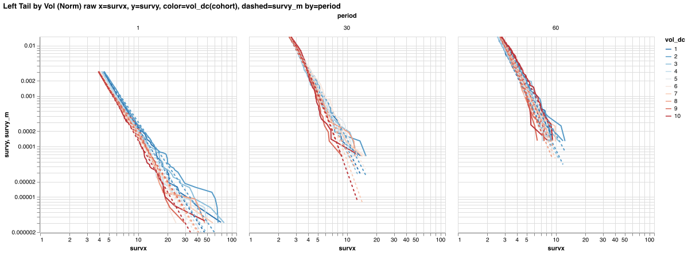
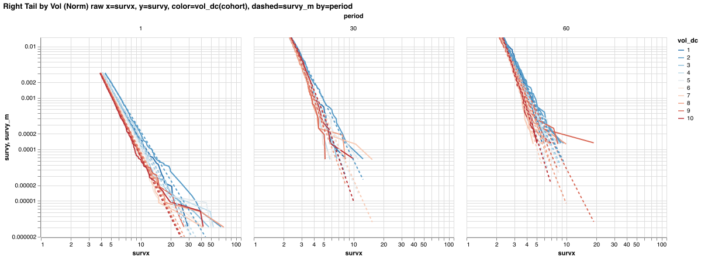

Left Tail (Norm) x=survxn, y=survy(cohort), dashed=survy_m by=period


Left Tail (Norm) by periods

```
3×3 DataFrame
 Row │ period  ν        ν_model
     │ Int64   Float64  Float64
─────┼──────────────────────────
   1 │      1      3.0      2.7
   2 │     30      3.8      3.5
   3 │     60      5.1      3.7
```

Right Tail (Norm) x=survxn, y=survy(cohort), dashed=survy_m by=period


Right Tail (Norm) by periods

```
3×3 DataFrame
 Row │ period  ν        ν_model
     │ Int64   Float64  Float64
─────┼──────────────────────────
   1 │      1      3.1      2.9
   2 │     30      4.7      3.7
   3 │     60      4.8      3.9
```

### Tails by Vol, normalised

Left Tail by Vol (Norm) raw x=survx, y=survy, color=vol_dc(cohort), dashed=survy_m by=period



Left Tail by Vol (Norm) x=survxn, y=survy, color=vol_dc(cohort), dashed=survy_m by=period


Left Tail by Vol (Norm) table

```
2×2 DataFrame
 Row │ period  ν
     │ Int64   Float64
─────┼─────────────────
   1 │      1      3.1
   2 │     30      4.0
```

```
20×5 DataFrame
 Row │ period  cohort  vol_dc  tail_k  ν
     │ Int64   Int64   Int64   Int64   Float64
─────┼─────────────────────────────────────────
   1 │      1       0       1     947      3.0
   2 │      1       0       2     967      2.8
   3 │      1       0       3     983      2.9
   4 │      1       0       4     980      3.1
   5 │      1       0       5     989      3.3
   6 │      1       0       6     986      3.6
   7 │      1       0       7     993      3.1
   8 │      1       0       8     995      3.1
   9 │      1       0       9     981      3.1
  10 │      1       0      10     904      3.5
  11 │     30       0       1     228      3.9
  12 │     30       0       2     232      4.0
  13 │     30       0       3     235      4.1
  14 │     30       0       4     235      3.9
  15 │     30       0       5     235      3.6
  16 │     30       0       6     235      3.4
  17 │     30       0       7     235      6.8
  18 │     30       0       8     236      3.9
  19 │     30       0       9     234      6.9
  20 │     30       0      10     215      6.9
```

Right Tail by Vol (Norm) raw x=survx, y=survy, color=vol_dc(cohort), dashed=survy_m by=period



Right Tail by Vol (Norm) x=survxn, y=survy, color=vol_dc(cohort), dashed=survy_m by=period


Right Tail by Vol (Norm) table

```
2×2 DataFrame
 Row │ period  ν
     │ Int64   Float64
─────┼─────────────────
   1 │      1      3.7
   2 │     30      6.8
```

```
20×5 DataFrame
 Row │ period  cohort  vol_dc  tail_k  ν
     │ Int64   Int64   Int64   Int64   Float64
─────┼─────────────────────────────────────────
   1 │      1       0       1     933      3.5
   2 │      1       0       2     950      3.2
   3 │      1       0       3     972      3.5
   4 │      1       0       4     972      3.5
   5 │      1       0       5     985      3.5
   6 │      1       0       6     988      3.9
   7 │      1       0       7     990      4.2
   8 │      1       0       8     984      3.8
   9 │      1       0       9     972      4.0
  10 │      1       0      10     960      3.8
  11 │     30       0       1     226      6.6
  12 │     30       0       2     228      4.0
  13 │     30       0       3     228      7.0
  14 │     30       0       4     236      7.3
  15 │     30       0       5     235      4.4
  16 │     30       0       6     236      7.4
  17 │     30       0       7     237      4.4
  18 │     30       0       8     236      5.5
  19 │     30       0       9     233      7.5
  20 │     30       0      10     228      7.1
```

### Tails by RSI, normalised

Left Tail by RSI (Norm) raw x=survx, y=survy, color=rsi_dc(cohort), dashed=survy_m by=period


Left Tail by RSI (Norm) x=survxn, y=survy, color=rsi_dc(cohort), dashed=survy_m by=period


Left Tail by RSI (Norm) table

```
2×2 DataFrame
 Row │ period  ν
     │ Int64   Float64
─────┼─────────────────
   1 │      1      3.1
   2 │     30      4.2
```

```
20×5 DataFrame
 Row │ period  cohort  rsi_dc  tail_k  ν
     │ Int64   Int64   Int64?  Int64   Float64
─────┼─────────────────────────────────────────
   1 │      1       0       1     955      3.3
   2 │      1       0       2     995      3.0
   3 │      1       0       3     991      3.2
   4 │      1       0       4     996      3.4
   5 │      1       0       5     997      3.2
   6 │      1       0       6     995      3.1
   7 │      1       0       7     992      2.9
   8 │      1       0       8     998      3.0
   9 │      1       0       9     997      3.4
  10 │      1       0      10     992      2.9
  11 │     30       0       1     234      7.0
  12 │     30       0       2     233      5.0
  13 │     30       0       3     237      4.8
  14 │     30       0       4     235      3.4
  15 │     30       0       5     237      4.0
  16 │     30       0       6     236      4.3
  17 │     30       0       7     236      3.2
  18 │     30       0       8     236      2.9
  19 │     30       0       9     237      3.8
  20 │     30       0      10     236      6.8
```

Right Tail by RSI (Norm) raw x=survx, y=survy, color=rsi_dc(cohort), dashed=survy_m by=period


Right Tail by RSI (Norm) x=survxn, y=survy, color=rsi_dc(cohort), dashed=survy_m by=period


Right Tail by RSI (Norm) table

```
2×2 DataFrame
 Row │ period  ν
     │ Int64   Float64
─────┼─────────────────
   1 │      1      3.5
   2 │     30      5.9
```

```
20×5 DataFrame
 Row │ period  cohort  rsi_dc  tail_k  ν
     │ Int64   Int64   Int64?  Int64   Float64
─────┼─────────────────────────────────────────
   1 │      1       0       1     983      3.4
   2 │      1       0       2     997      3.6
   3 │      1       0       3     994      3.3
   4 │      1       0       4     990      4.1
   5 │      1       0       5     998      4.2
   6 │      1       0       6     997      3.8
   7 │      1       0       7     991      3.3
   8 │      1       0       8     989      3.4
   9 │      1       0       9     986      3.4
  10 │      1       0      10     941      3.7
  11 │     30       0       1     233      7.2
  12 │     30       0       2     236      7.2
  13 │     30       0       3     237      4.8
  14 │     30       0       4     237      7.5
  15 │     30       0       5     235      7.2
  16 │     30       0       6     236      4.0
  17 │     30       0       7     236      4.3
  18 │     30       0       8     233      4.1
  19 │     30       0       9     232      4.5
  20 │     30       0      10     231      7.0
```

### Tails by Vol and RF rate, normalised

Left Tail by Vol, RF (Norm) νs x=lr_rf_medn, y=ν, color=vol_dc


Right Tail by Vol, RF (Norm) νs x=lr_rf_medn, y=ν, color=vol_dc


### Tails for all periods, normalised

Left Tail all Periods (Norm) x=survxn, y=survy(cohort), dashed=survy_m by=period


Left Tail all Periods (Norm) by periods

```
8×3 DataFrame
 Row │ period  ν        ν_model
     │ Int64   Float64  Float64
─────┼──────────────────────────
   1 │      1      3.0      2.7
   2 │     30      3.8      3.5
   3 │     60      5.1      3.7
   4 │     91      6.7      3.8
   5 │    182      6.8      3.9
   6 │    365      6.8      4.1
   7 │    730      6.5      4.3
   8 │   1095      5.4      4.3
```

Right Tail all Periods (Norm) x=survxn, y=survy(cohort), dashed=survy_m by=period


Right Tail all Periods (Norm) by periods

```
8×3 DataFrame
 Row │ period  ν        ν_model
     │ Int64   Float64  Float64
─────┼──────────────────────────
   1 │      1      3.1      2.9
   2 │     30      4.7      3.7
   3 │     60      4.8      3.9
   4 │     91      4.7      4.0
   5 │    182      5.6      4.1
   6 │    365      6.8      4.3
   7 │    730      7.1      4.5
   8 │   1095      7.3      4.5
```

Tails by periods x=period, y=ν, color=type, dashed=ν_model


