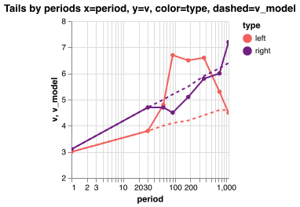

Estimating tail exponent of stock log returns

Run `julia tail/tail.jl`.

# Goal

Estimate left and right tails for stock log returns for different periods 1d, 30d, 365d periods
and volatility levels, from historical data.

Normal US NYSE+NASDAQ stock only, no penny stock like AMEX or OTC.

# Results



Data has 3.4m days. Reliable estimation require 10k sample size or <340d periods, rough
estimation 5k or <680d. And if grouped by 10 volatility levels <34d and for 5 vol levels <68d.

**1d: ν_l=2.7, ν_r=2.9**, normalised returns. It depends how returns
normalised, varying 2.7-3.2.

For larger periods: **30d: ν_l=3.5, ν_r=3.7**. Note 30d has x30 less data than 1d returns,
still it should be enough to estimate the tail. Periods >=60d less realiable, they have much
less data, and maybe the data bias more prominent.

Mathematically the exponent should be resistant to aggregation `Pr(X>x|for large x) ~ Cx^-ν`, but
it may not be true for a) if x sampled from differrent distributions and b) pre asymptotic
c) bounded x.

In my opinion larger periods follow `ν = a + b log T`, solving it for 1d and 30d:

```
ν_l(t) = 2.7 + 0.2352log(t)
ν_r(t) = 2.9 + 0.2352log(t)
```

Data has both omission (bankrupts) and comission biases - so tails may be a bit wrong.

# Methodology

- Historical log returns `log r_t2 = log S_t/S_t2` for `t in [1d, 30d, ..., 1095d]`.
- Volatility `nvol_t = 0.8 current_vol_t + 0.2 historical_vol`, where current over recent period
  `EMA[MAD[log r]]*sqrt(pi/2)` and historical `MAD[log r]*sqrt(pi/2)` over long period.
- Normalise log returns as `log r_t2 / nvol_t`, each return individually.
- Decluster per stock, allow no more than 1 tail event within window = 30d for 1d returns and
  larger windows for longer periods.
- Allow clusters across stocks - when many stock drop on same day.
- EVT POT GPD approach with [DEDH-HILL](/tail-estimator) estimator.

# Other studies

Results depend on return normalisation, so results may be different.

**Study1**: [Tail Index Estimation: QuantileDriven Threshold Selection](https://www.bankofcanada.ca/wp-content/uploads/2019/08/swp2019-28.pdf)
, one of authors is Laurens de Haan, pioneer of EVT and inventor of one of the best estimators
"DEDH", so I guess numbers they got analysing CRSP stock returns are worth to consider.

Results from KS estimator: left tail 3.4, right tail 2.97 from [Table 7](docs/study1-table7.jpg).
Estimator has bias 3/2.85 from [Table 1](docs/study1-table1.jpg). Correcting results left tail
3.4 * 3/2.85 = 3.58, right tail 2.97 * 3/2.85 = 3.13.

**Study2**: various mentions by N. Taleb that tails ~3.

# Data

Daily prices of 250 stocks all starting with 1972, [details](/hist_data)`.

1d and 30d returns calculated with moving window(size=30, step-30).

For larger periods >=60d, cacluation a bit more complex, using cohorts, you can ignore details
and just consider it as multiple version of same returns, you will see it as multiple lines
on plots with periods >=60d. It's used to get more information from the data and avoid
overlapping bias, correlation, returns calculated as moving window(start=cohort, size=period,
step=period), each cohort shifts initial position by +30.

# Questions

I used approach different from standard EVT POT GPD. The standard approaches
have problems MLE - huge bias and variance, HILL - very sensitive to threshold
parameter and even then has bias, DEDH - the best, but still has some bias. I found combining
DEDH-HILL gives the best result. And the threshold choosen differently, assuming that log return
tails are somewhat similar to StudenT tails, the optimal threshold found by simulation.
I think it's the best approach, more precise than standard EVT. It's described
in [Tail Estimator](/tail-estimator) experiment. The standard DEDH method would produce slightly
worst results.

I think the **tail exponent resistant to aggregation** and so should be the same for 1d,
30d, 365d log returns. Mathematically it is so `Pr(X>x) ~ Cx^-ν`, ν doesn't depend on
aggregation.  The empirical estimation shows different story - tail exponent is growing with
the period, but I believe it's a random artefact, because there's much less data for
larger periods, and in reality tail exponent is the same.

My data is biased, no bankrupts, if you have access to full market unbiased data,
**let me know** please, I would be interested to analyse it.

If you find errors or know a better way, let me know please.

# TODO

- Decluster 1d data - across same stock within 30 days, and across multiple stocks - only
  single stock maxima per same day.
- In order to avoid submission bias - estimate tail for each stock individually and analyse it.
- Calculate credible intervals.
