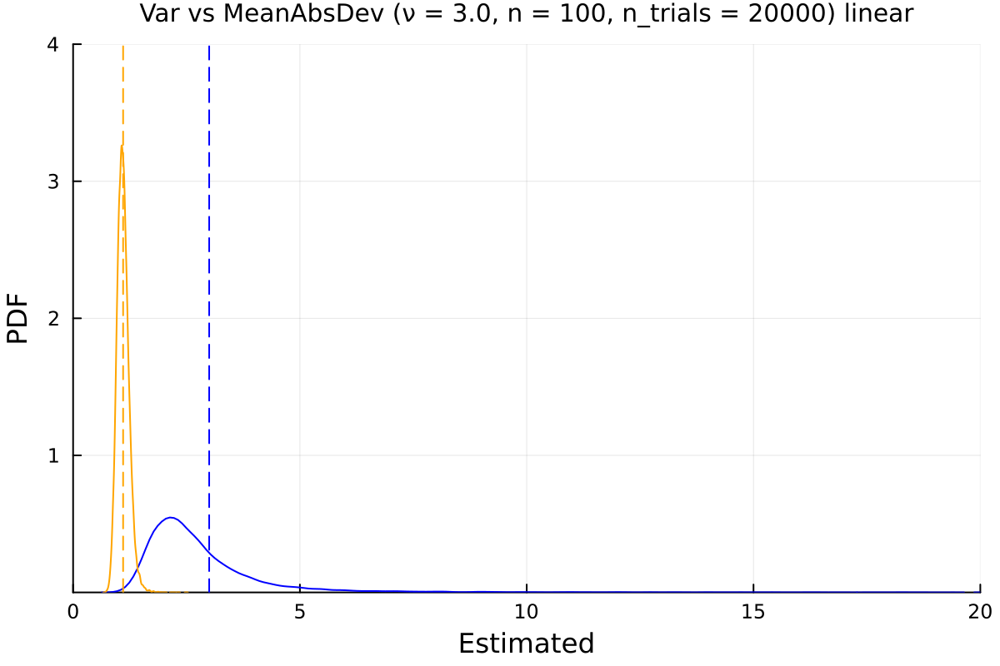
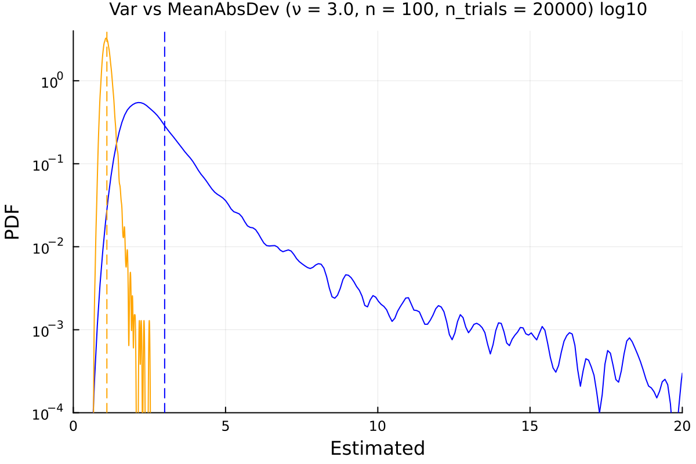
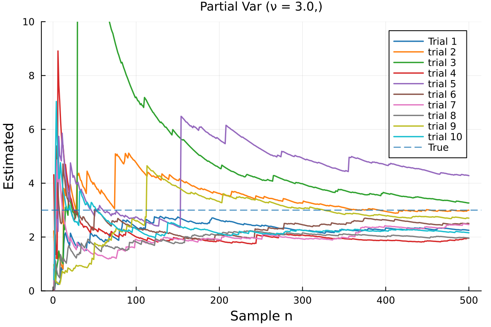
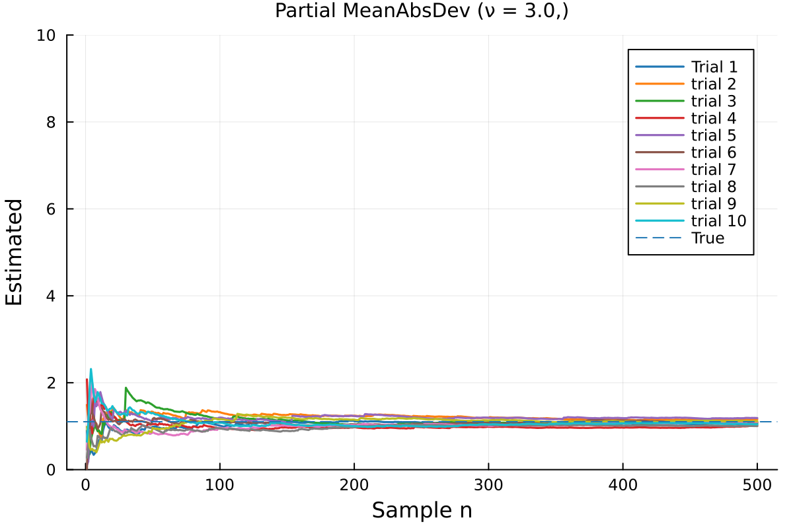

### Convergence of Variance and Mean Absolute Deviation

Var vs MeanAbsDev (ν = 3.0, n = 100, n_trials = 20000) linear

Var vs MeanAbsDev (ν = 3.0, n = 100, n_trials = 20000) log10

### Partial Convergence of Variance and Mean Absolute Deviation

Partial Var (ν = 3.0,)

Partial MeanAbsDev (ν = 3.0,)

